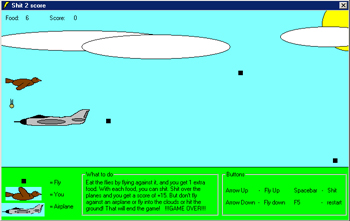



## Bird Game

### Description

You have to s*h*i*t on to planes, you can s*h*i*t for every food you have. Your food increases by eating flies. I'm working on a directdraw version.
 
### More Info
 
It works best in Win2000/NT. I wrote it in 2000, and because the timer interval in 2000/NT is differnt from Win 9x/ME it runs a lot slower.

             |
---                |---
**Submitted On**   |2000-08-29 19:52:44
**By**             |[N/A](https://github.com/Planet-Source-Code/PSCIndex/blob/master/ByAuthor/empty.md)
**Level**          |Intermediate
**User Rating**    |4.0 (8 globes from 2 users)
**Compatibility**  |VB 6\.0
**Category**       |[Games](https://github.com/Planet-Source-Code/PSCIndex/blob/master/ByCategory/games__1-38.md)
**World**          |[Visual Basic](https://github.com/Planet-Source-Code/PSCIndex/blob/master/ByWorld/visual-basic.md)
**Archive File**   |[CODE\_UPLOAD105461092000\.zip](https://github.com/Planet-Source-Code/bird-game__1-11970/archive/master.zip)

